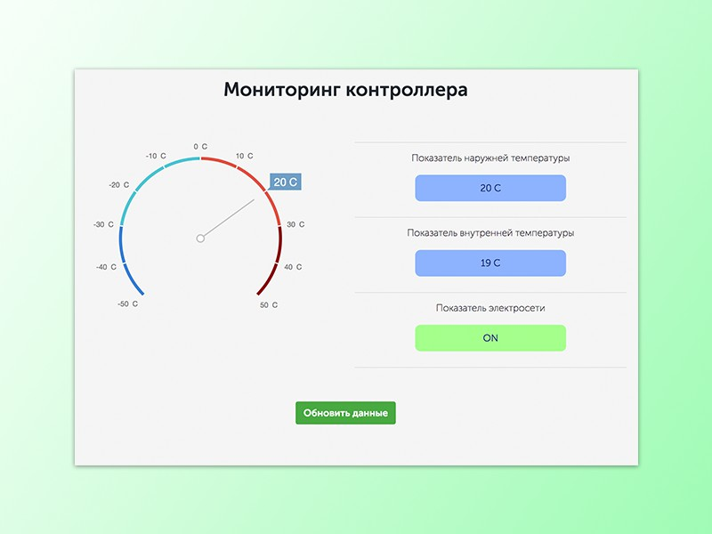

# Monitoring

  
  
Задача создать приложение с помощью которого можно было бы выводить показатели из базы данных на монитор (смартфон) в режиме онлайн с возможностью ручного обновления. Для решения данной задачи использовал JS Ajax , PHPmySql (требование заказчика), PHP и для стилей и верстки использовал bootstrap и flex. 

Срок выполнения: 1 день
Стоимость работ: 1500р
